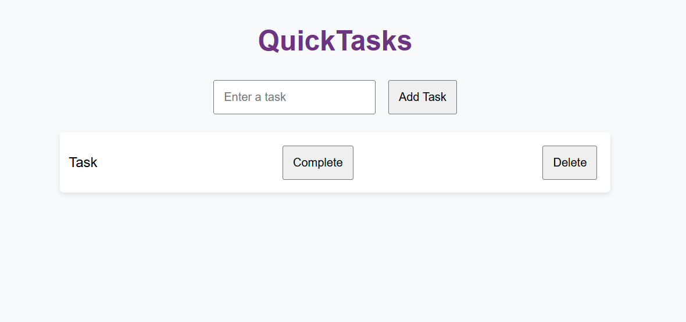

# QuickTasks - A Simple FastAPI To-Do App

QuickTasks is a lightweight To-Do application built using **FastAPI (backend)** and **JavaScript (frontend)**. It allows users to **create, read, update, and delete tasks** while storing them in memory.

---

## Features
- **CRUD operations** for tasks (Create, Read, Update, Delete)
- **FastAPI backend** with in-memory data storage
- **JavaScript frontend** using Fetch API for communication
- **Simple and responsive user interface**
- **CORS-enabled** for frontend-backend communication

---

## Installation & Setup


### **Create a Virtual Environment**
```sh
python -m venv venv
```

**Activate the virtual environment:**

- **Windows (PowerShell/CMD):**
  ```sh
  venv\Scripts\activate
  ```
- **Mac/Linux:**
  ```sh
  source venv/bin/activate
  ```

### **Install Dependencies**
```sh
pip install fastapi uvicorn
```

### **Run the FastAPI Backend**
```sh
uvicorn main:app --reload
```

### **Serve the Frontend**
Run the index.html file

---


